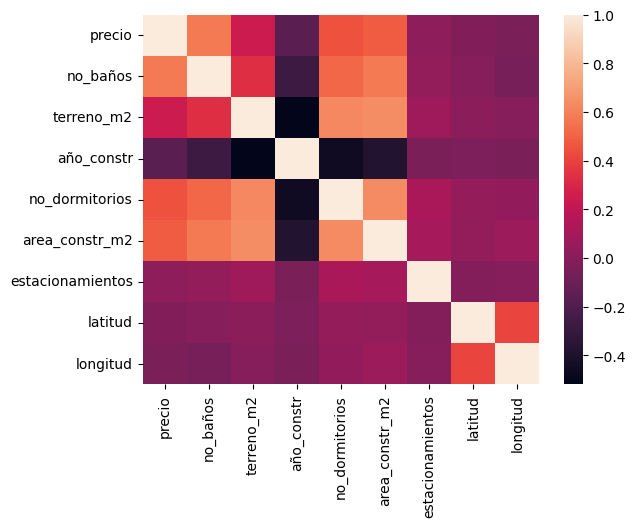
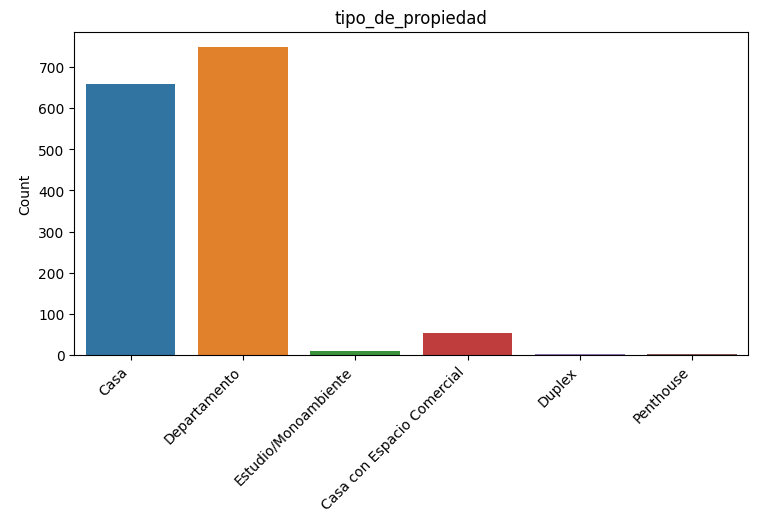
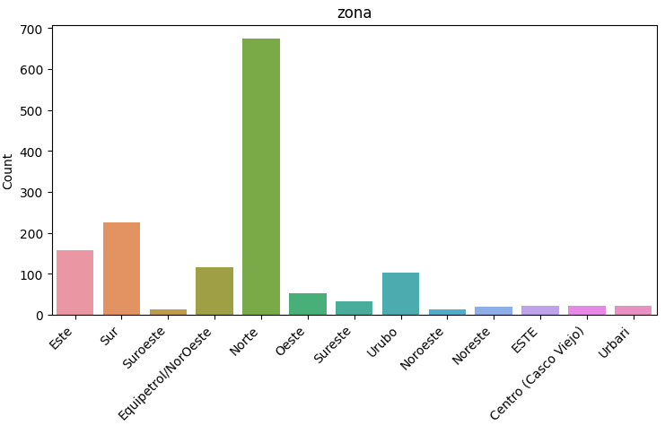
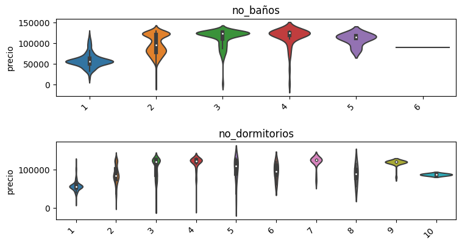
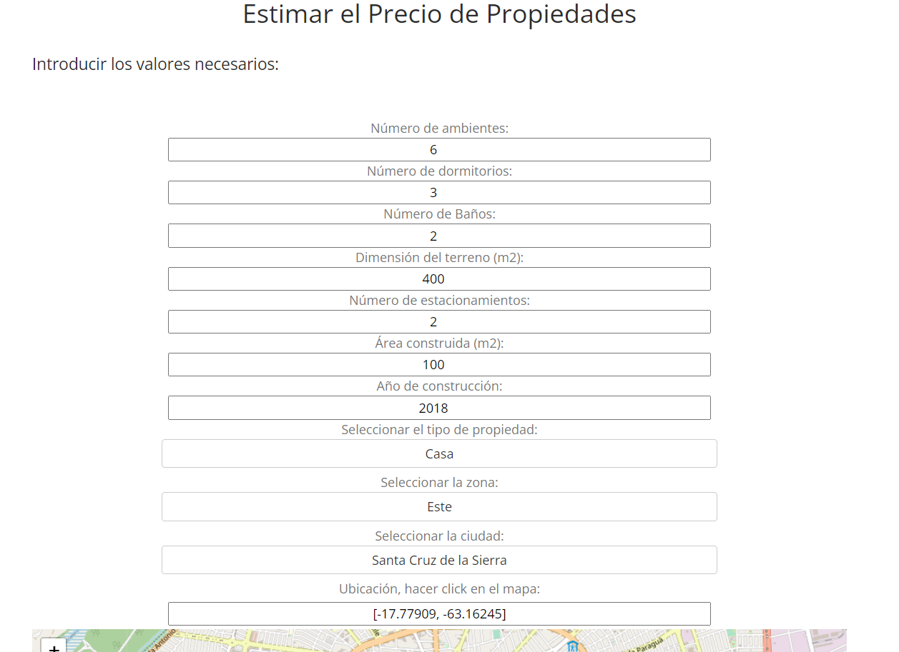
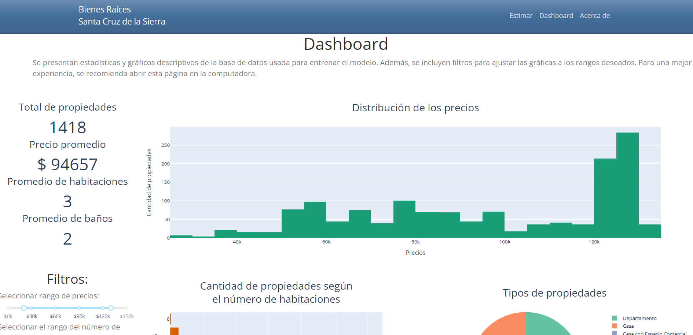

# Santa Cruz de la Sierra Housing Price Estimator

## Project Summary

* This is the repo for a web application that **estimates housing prices** in Santa Cruz de la Sierra, Bolivia. The results can be used for a variety of common scenarios.
* Data was extracted using **Web scraping** from websites where houses are listed, including their prices and various characteristics.
* Data preprocessing and **feature engineering** techniques were applied to extract useful features for modeling.
* Various regression algorithms were trained, **grid search** was used to optimize hyperparameters and select the best model. The models tested included *Lasso Regression*, *Random Forest Regressor*, *Gradient Boosting Regressor*, Multilayer Perceptron, and *KNN Regressor*.
* A **website** was built using **Dash** to allow the use of the selected model. It also provides access to a **dashboard** to explore the used database.
* Additionally, the model is accessible through an **API**, implemented using **Flask**.

## Website

The web application is accessible through the following link, hosted by Google Cloud:

[realstate-scz.dsapp.me](https://realstate-scz.dsapp.me/)

## Requirements

* **Python Version:** 3.10
* **Libraries:** selenium, numpy, pandas, matplotlib, seaborn, scikit-learn, plotly, dash
* **Requirements for reproducing the analysis:** requirements.txt
* **Conda environment:** environment.yml
* **Requirements for the app:** requirements_app.txt

## Web Scraping

Data was obtained from websites where houses are listed. Along with the price, various characteristics such as dimensions, number of rooms, location, among others, are listed.

The following features were selected: Property description, Price, Location description, Number of rooms, Number of bathrooms, Land area (in m2), Year of construction, Number of bedrooms, Built area, Number of parking spaces, Location: latitude and longitude.

**Selenium** was used for this step, and data from 1520 properties were obtained.

## Data Preprocessing

The data had to go through a preprocessing process to ensure its quality. The following steps were taken:

* The city and zone were extracted from the location description.
* The consistency of the construction date was ensured, and only the year was taken.
* Decimal places were removed from coordinates for privacy reasons.
* When inspecting duplicate values, it was found that most of them correspond to different properties within the same real estate project. Therefore, these points were retained for modeling.

## Exploratory Data Analysis

The first step in this stage was to explore missing values and choose imputation techniques for each case. Then, the data type of each column were corrected.

Once a clean database was obtained, various visualizations were analyzed. Some notable ones are shown below.

    

  

## Model Construction

The model that performed best was the **Gradient Boosting Regressor**, using the test set and using the coefficient of determination, *r2*, as the metric.

To achieve this result, **GridSearch** with **Cross Validation** was used to find the best hyperparameters for the considered algorithms. These were: *Random Forest Regressor*, *Gradient Boosting Regressor*, and *KNN Regressor*. The imputation techniques for missing values discussed earlier were also integrated.

*Lasso Regression* was chosen as the base model, and the other three were considered due to the non-linear nature of the problem: property prices are strongly dependent on location, represented by points on a plane.

## Model Performance

* **Lasso Regression**: R2(test set) = 0.534
* **Gradient Boosting Regressor**: R2(test set) = 0.897
* **Random Forest Regressor**: R2(test set) = 0.871
* **KNN Regressor**: R2(test set) = 0.853

## Deployment

The model is made accessible through a website using **Dash** as a framework. Deployment was possible using **Google Cloud Run**, Google's serverless service. This service manages the Docker container for the web application.

The main page presents the inputs for the model. Once the user hits enter, the estimate is shown. Additionally, The page also displays an interactive **Dashboard** to explore the data in detail.

  

## Next Steps

It is necessary to gather more data to expand the range of prices and property categories covered by the model. With more data, properties above the current $130,000 limit of the model can be covered.

Additionally, with a broader data collection, the analysis can be extended to cover other cities in Bolivia.

## API

An API endpoint was also built. For more details visit: [Link to the API repository](https://github.com/a-jimenezc/bienes_raices_scz_api "Click to access the repository").

## License

GNU General Public License v2.0

## Author

Antonio Jimenez Caballero

## Contact

[Linkedin](https://www.linkedin.com/in/antonio-jimnzc/)

